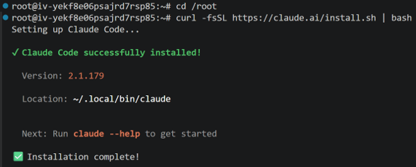
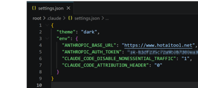
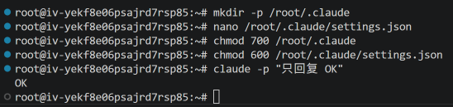

# 第19节 实验手册：OpenClaw 调度 Claude Code 完成 GitHub 安全巡检

> 配套课程：AI 业务流架构师 · 第19节 多 Agent 协作：夜间代码自愈实验室  
> 操作方式：实验零在服务器命令行完成；实验一开始再把 Prompt 交给龙虾执行  
> 预计耗时：40-60 分钟

---

## 实验目标

1. 安装 Claude Code，并确认 OpenClaw 能调用它。
2. 安装 `github-secret-auditor` Skill。
3. 验证 OpenClaw 通过 ACP / ACPX 调度 Claude Code。
4. 完成一次只读试跑，确认 Claude Code 进入授权仓库。
5. 执行一次 GitHub 密钥泄露巡检，并由 OpenClaw 验收、提交、推送和飞书汇报。

---

## 核心链路

```text
用户给出仓库
-> OpenClaw 读取 Skill
-> 准备仓库和任务包
-> 检查 active_session_count，获取 single-flight lock
-> sessions_spawn(mode="run") 调度 Claude Code
-> Claude Code 巡检 / 修复 / 输出摘要
-> OpenClaw 验收 Git Diff
-> 必要时 sessions_send 补漏到同一个 childSessionKey
-> OpenClaw commit / push / 飞书报告
-> 关闭/回收 child session，释放 lock，active_session_count=0
```

默认测试仓库：

```text
https://github.com/lemons101/agentic-ai.git
```

默认路径：

```text
/root/projects/github-secret-auditor-skill
/srv/openclaw-runner/repos/agentic-ai
/srv/openclaw-runner/tasks/agentic-ai-secret-audit.json
/srv/openclaw-runner/reports/agentic-ai-security-report.md
```

安全边界：

- 只操作授权仓库。
- 不读取真实 `.env`、私钥、Cookie、生产配置和用户个人目录。
- Claude Code 不 push；push 只由 OpenClaw 验收后执行。
- 报告只发飞书或写入 `/srv/openclaw-runner/reports`，不要提交进仓库。
- 同一仓库和分支同一时刻只允许 1 个活动 Claude ACP child session；成功、失败或超时都必须关闭/回收。

---

## 实验零：安装 Claude Code

这一拍的目标不是开始巡检，而是先把“执行者”装好：让 OpenClaw 后面能通过 ACP 调度 Claude Code。

官方文档：

```text
https://docs.anthropic.com/en/docs/claude-code/getting-started
https://code.claude.com/docs/en/installation
```

课堂服务器推荐使用安装脚本：

```bash
cd /root
curl -fsSL https://claude.ai/install.sh | bash
```

安装成功后参考这张图确认：



这一步不要发给龙虾执行。请在服务器 SSH / Terminal 里自己完成，尤其是 `settings.json` 里的 API Key，不要通过飞书、聊天窗口或截图暴露。

创建配置目录：

```bash
mkdir -p /root/.claude
chmod 700 /root/.claude
nano /root/.claude/settings.json
```

如果使用 Claude 官方登录，按交互式登录完成认证即可。

如果使用 Anthropic 兼容中转服务，在 `settings.json` 中写入下面的结构。注意：`ANTHROPIC_AUTH_TOKEN` 只能写自己的真实值，课程文档、GitHub、飞书消息和截图里都不要出现完整密钥。

`settings.json` 示例说明：

```json
{
  "theme": "dark",
  "env": {
    "ANTHROPIC_BASE_URL": "https://<your-anthropic-compatible-endpoint>",
    "ANTHROPIC_AUTH_TOKEN": "<YOUR_API_KEY_DO_NOT_SHARE>",
    "CLAUDE_CODE_DISABLE_NONESSENTIAL_TRAFFIC": "1",
    "CLAUDE_CODE_ATTRIBUTION_HEADER": "0"
  }
}
```

配置要点：

- `ANTHROPIC_BASE_URL`：Anthropic 兼容接口地址；如果使用官方交互式登录，可不填这一项。
- `ANTHROPIC_AUTH_TOKEN`：API Key，只能保存在服务器本地配置中，不要写进课件、仓库、飞书消息或截图。
- `CLAUDE_CODE_DISABLE_NONESSENTIAL_TRAFFIC`：减少非必要网络流量，课堂服务器建议开启。
- `CLAUDE_CODE_ATTRIBUTION_HEADER`：如中转服务不支持 attribution header，可设为 `"0"`。
- `/root/.claude/settings.json` 必须设置为 `600`，避免其他用户读取。

配置文件可参考这张示例图：



保存配置后执行：

```bash
chmod 600 /root/.claude/settings.json
claude -p "只回复 OK"
```

如果 OpenClaw gateway 不是 root 用户启动的，还要确认 gateway 运行用户也能访问同一个 `claude` 命令和对应配置。否则终端里能跑通，OpenClaw 仍然可能调度失败。

通过标准：

- `command -v claude` 有明确路径。
- `/root/.claude/settings.json` 存在，且没有暴露完整密钥。
- `claude -p "只回复 OK"` 返回 `OK`。
- OpenClaw 运行用户能访问同一个 `claude` 命令。

验证通过后参考这张图确认：



---

## 实验一：安装 github-secret-auditor Skill

发给龙虾：

```text
请帮我安装并更新第19节实验用的 github-secret-auditor Skill。

目录：
- Skill：/root/projects/github-secret-auditor-skill
- 仓库：/srv/openclaw-runner/repos
- 任务包：/srv/openclaw-runner/tasks
- 报告：/srv/openclaw-runner/reports

请执行：
1. 创建目录：
   mkdir -p /root/projects /srv/openclaw-runner/repos /srv/openclaw-runner/tasks /srv/openclaw-runner/reports

2. 如果 Skill 已存在：
   cd /root/projects/github-secret-auditor-skill && git pull --ff-only

3. 如果 Skill 不存在：
   cd /root/projects && git clone git@github.com:lemons101/github-secret-auditor-skill.git

4. 记录版本：
   cd /root/projects/github-secret-auditor-skill && git rev-parse --short HEAD

5. 检查文件：
   - SKILL.md
   - templates/run_skill_prompt.md
   - templates/acp_steer_prompt.md
   - templates/openclaw_task.secret_audit.json
   - references/preflight_setup.md

暂时不要执行巡检、不要修改目标仓库、不要 push。

回报：
- Skill 安装状态：passed / failed
- Skill 路径
- 当前 commit
- 关键文件是否齐全
- 如失败，贴核心报错
```

通过标准：

- Skill 在 `/root/projects/github-secret-auditor-skill`。
- 关键文件齐全。
- 能记录当前 git commit，方便排查版本差异。

---

## 实验二：验证 ACP 握手

注意：`/acp ...` 是飞书 / OpenClaw 对话框命令，不是 shell 命令。

在飞书 / OpenClaw 对话框发送：

```text
/acp doctor
```

期望：

```text
configuredBackend: acpx
registeredBackend: acpx
healthy: yes
```

到这里先不创建 Claude Code 会话。

原因：`/acp spawn` 或 `sessions_spawn` 都需要指定 `cwd`，也就是目标仓库路径。目标仓库要到实验三才准备好。

本实验只确认一件事：OpenClaw 的 ACPX 后端是健康的，后面可以调度 Claude Code。

---

## 关键配置

### 允许课堂演示环境写入授权仓库

如果 Claude Code 只能分析、不能修改授权仓库，可临时设置：

```bash
openclaw config set plugins.entries.acpx.config.permissionMode approve-all
openclaw config set plugins.entries.acpx.config.nonInteractivePermissions fail
```

设置后必须：

1. 重启 OpenClaw gateway。
2. 重新执行 `/acp doctor`。
3. 先关闭/回收旧 Claude ACP 会话，再重新创建新会话。

旧 session 可能沿用旧权限，也可能继续占用 ACP child process；不要在旧 session 未回收时直接创建新的 session。

实验结束后建议恢复：

```bash
openclaw config set plugins.entries.acpx.config.permissionMode approve-reads
openclaw config set plugins.entries.acpx.config.nonInteractivePermissions deny
```

### 开启后台补漏投递

如果要使用 `sessions_send` 补漏，确认：

```bash
openclaw config set tools.sessions.visibility all
openclaw config set tools.agentToAgent.enabled true
```

典型错误：

```text
Session send visibility is restricted
Agent-to-agent messaging is disabled
```

看到这些错误：设置配置、重启 gateway、先回收旧 session，再重新创建 session。

---

## 实验三：准备仓库和任务包

发给龙虾：

```text
请准备第19节安全巡检实验的测试仓库和任务包。

目标仓库：
https://github.com/lemons101/agentic-ai.git

本地路径：
/srv/openclaw-runner/repos/agentic-ai

任务包路径：
/srv/openclaw-runner/tasks/agentic-ai-secret-audit.json

报告路径：
/srv/openclaw-runner/reports/agentic-ai-security-report.md

请执行：
1. 如果本地仓库不存在，clone 到 /srv/openclaw-runner/repos/agentic-ai。
2. 如果本地仓库已存在，先执行 git status --short。
3. 如果工作区不干净，停止并回报 failed，不要 reset，不要覆盖。
4. 如果工作区干净，执行 git pull --ff-only。
5. 基于 Skill 模板生成任务包到 /srv/openclaw-runner/tasks/agentic-ai-secret-audit.json。

任务包至少包含：
- repo_url: https://github.com/lemons101/agentic-ai.git
- repo_path: /srv/openclaw-runner/repos/agentic-ai
- branch: main
- allow_auto_fix: true
- allow_push: true
- report_path: /srv/openclaw-runner/reports/agentic-ai-security-report.md

安全规则：
- 不读取真实 .env、私钥、Cookie、生产配置和用户个人目录。
- 不输出完整密钥。
- 不提交 security-report.md。
- Claude Code 不 push，push 由 OpenClaw 验收后执行。

回报：
- 仓库当前 commit
- git status --short
- 任务包路径
- repo_url / repo_path / report_path
- 是否有阻塞问题
```

换仓库时至少同步修改：

```text
repo_url
repo_path
task_file
report_path
仓库目录名
```

---

## 实验四：创建并记录 ACP 会话：只读试跑

这一步才真正创建 Claude Code ACP 会话，并记录后续补漏投递要用的 `childSessionKey`。

先做只读试跑，不允许修改文件。创建前必须检查同一 `repo_url + branch + skill` 是否已有活动 session，但不是一看到已有 session 就永远不测：

- 如果已有 session 正在执行当前有效任务，不要抢占，也不要再次 spawn；等待它结束或让用户确认是否取消。
- 如果已有 session 是上一轮只读测试、已超时、已失败或确认卡住的残留会话，先关闭/取消/回收它，并释放 single-flight lock。
- 只有确认 `active_session_count == 0` 后，才允许继续创建新的只读试跑 session。

发给龙虾：

```text
请通过 OpenClaw Sessions API 调度 Claude Code 做只读试跑。

调用要求：
- 调用前检查是否已有活动 child session，并判断它是有效任务还是残留会话
- 有效任务正在跑：跳过本轮或等待，不要再次 spawn
- 残留/超时/失败 session：先关闭/取消/回收，确认 active=0 后再获取 single-flight lock
- runtime="acp"
- agentId="claude"
- mode="run"
- thread=false
- cwd="/srv/openclaw-runner/repos/agentic-ai"
- 设置 TTL / deadline_at，避免只读试跑卡住后残留进程
- prompt="请输出 pwd 和 git status --short，不要修改文件。"

等价形态：
sessions_spawn(
  runtime="acp",
  agentId="claude",
  mode="run",
  thread=false,
  cwd="/srv/openclaw-runner/repos/agentic-ai",
  prompt="请输出 pwd 和 git status --short，不要修改文件。"
)

回报：
- status
- childSessionKey，必须是完整的 agent:claude:acp:...
- lock_key
- started_at / deadline_at
- pwd
- git status --short
- 是否有文件被修改
- 如失败，贴核心报错，并确认是否已关闭/回收本轮 session、是否已释放 lock
```

说明：

- 后台自动化里，这个记录叫 `childSessionKey`。
- 飞书 slash command 演示里，这个记录叫 `session-key`。
- 两者本质上都是同一个东西：Claude Code ACP 会话地址，格式是 `agent:claude:acp:<uuid>`。
- 后续 `sessions_send` 补漏时，必须使用完整值，不要只复制 UUID。
- 实验四创建的是测试 session，只用于实验五验证补漏投递；实验五结束后必须关闭/回收，不要留给最终巡检复用。

通过标准：

```text
childSessionKey: agent:claude:acp:...
pwd: /srv/openclaw-runner/repos/agentic-ai
git status --short: 空
```

如果 `pwd` 不对或工作区不干净，不进入最终巡检。

---

## 实验五：验证补漏投递并回收测试会话

发给龙虾：

```text
请使用上一轮返回的 childSessionKey 做 sessions_send 只读测试。

要求：
- sessionKey 使用完整 agent:claude:acp:...
- 只能 `sessions_send` 到实验四返回的同一个 childSessionKey，不要重新 `sessions_spawn`
- 不修改文件
- 不 push

等价形态：
sessions_send(
  sessionKey="<childSessionKey>",
  prompt="只读测试：请再次输出 pwd 和 git status --short，不要修改文件。"
)

回报：
- sessions_send 是否成功
- pwd
- git status --short
- 是否有文件被修改
- 如失败，贴核心报错
- 测试结束后是否已关闭/回收 child session
- closed_at
- active_session_count 是否已回到 0
```

注意：`childSessionKey` 是投递目标，不是记忆保证。真正补漏时，prompt 必须带上：

- 上一轮输出
- 当前 Git Diff
- 验收缺失项
- 本轮允许修改范围

不要只写“继续修一下”。

补漏投递验证完成后，必须要求 OpenClaw 调用 Sessions/ACP runtime 提供的关闭、取消或回收能力释放这个测试 `childSessionKey`，并释放 single-flight lock。确认 `active_session_count=0` 后，才进入实验六。

---

## 实验六：执行最终安全巡检

只读试跑和补漏投递通过后，执行最终实验。

注意：实验六是正式巡检，会创建正式的 Claude ACP child session；它不能复用实验四/五的测试 session。正式巡检结束、失败、超时或被取消时，OpenClaw 必须关闭/回收本轮 child session，释放 single-flight lock，并确认 `active_session_count=0`。如果无法确认回收完成，本次实验不能算通过。

发给龙虾：

```text
请使用 /root/projects/github-secret-auditor-skill/SKILL.md 执行一次全自动 GitHub 密钥泄露巡检。

目标仓库：
https://github.com/lemons101/agentic-ai.git

要求：
1. 全程自动化执行，不要让我手动复制 session、手动执行命令、手动拼接 prompt 或手动验收。
2. OpenClaw 自动读取 Skill、准备仓库、生成任务包、通过 ACP Sessions API 调度 Claude Code、验收修复、commit、push，并通过飞书汇报。
3. 调度前必须检查 single-flight lock：同一目标仓库和分支已有活动 child session 时，不要再次 `sessions_spawn`；巡检结束、失败或超时后必须关闭/回收 child session 并释放锁。
4. Claude Code 负责仓库内敏感信息巡检和代码修复；OpenClaw 不要手工替代 Claude Code 修复。
5. 安全巡检先判断仓库是否存在泄露，再按仓库实际结构做最小安全修复。
6. 不要把修复固定成 .env.example / README / .gitignore 三件套。
7. 最终返回前必须确认本轮 Claude ACP child session 已关闭/回收、single-flight lock 已释放、active_session_count=0；如果无法确认，状态返回 failed 并说明原因。
8. 最终只回复巡检结果、是否修复、是否推送、commit、会话回收状态、风险摘要、风险备注和下一步建议。

最终回复格式：

状态：passed / failed
目标仓库：lemons101/agentic-ai
是否调用 Claude Code：yes / no
调用方式：acp / failed
是否已推送到 GitHub：yes / no
commit：<commit hash>
会话回收：closed / failed / unknown
active_session_count：0 / <非 0 值或 unknown>
closed_at：<timestamp or empty>
修改文件：
- ...
风险摘要：
- ...
已完成修复：
- ...
残余风险：
- ...
风险备注：
- ...
下一步建议：
- ...
```

---

## 结果判断

### 通过并修复

应看到：

- `状态：passed`
- `是否调用 Claude Code：yes`
- `调用方式：acp`
- 有 commit hash
- 飞书报告包含风险摘要、修改文件、push 状态和下一步建议

同时检查：

- GitHub 上有普通修复 commit。
- commit 中没有 `security-report.md`。
- diff 只包含授权仓库内修复。
- 报告不输出完整密钥。

### 未发现泄露

也可能是成功结果。重点看：

- 说明巡检通过。
- 不强行改文件。
- 不强行 commit。
- 有报告或结果摘要。

### failed

必须返回明确原因，例如：

- ACP runtime 不可用
- GitHub 权限不足
- 工作区不干净
- Claude Code 无法写文件
- `sessions_send` visibility / agent-to-agent 权限不足
- 已有活动 child session，新的巡检被 single-flight lock 跳过
- Claude Code session 超过 TTL，被取消并回收

---

## 验收标准

完成实验时，应满足：

- Claude Code 安装并验证通过。
- Skill 安装到 `/root/projects/github-secret-auditor-skill`。
- `/acp doctor` 返回 healthy。
- 只读试跑返回正确 `pwd` 和空的 `git status --short`。
- 最终巡检通过 ACP Sessions API 调度 Claude Code。
- 调度前检查 single-flight lock；实验结束后 child session 已关闭/回收，active_session_count 回到 0。
- Claude Code 只在授权仓库内工作。
- 不读取真实 `.env`、私钥、Cookie、生产配置和用户个人目录。
- Claude Code 不 push；OpenClaw 验收后才 commit / push。
- 飞书报告或 `/srv/openclaw-runner/reports` 有巡检结果。
- 报告未提交进 GitHub 仓库。

---

## 常见问题

- `claude: command not found`：检查 `~/.local/bin/claude` 是否存在，并确认 `~/.local/bin` 在 PATH 中。
- 当前终端能运行 `claude`，OpenClaw 不能：多半是 gateway 运行用户或 PATH 不一致。
- `claude -p "只回复 OK"` 失败：检查认证、API Key 或中转配置。
- `/acp doctor` 失败：检查 ACPX 后端配置，并重启 gateway。
- `/acp` 在 shell 中失败：正常，`/acp` 只能在飞书 / OpenClaw 对话框执行。
- `/acp spawn` 失败：检查 `--cwd` 是否存在且为授权仓库。
- 重复触发巡检但已有活动 session：正常应跳过本轮或等待已有任务，不要再次 `sessions_spawn`。
- Claude Code 只能分析不能写：检查 ACPX 写入权限和文件系统权限。
- 改了 `approve-all` 仍不能写：重启 gateway，先关闭/回收旧 session，再重新创建 session。
- `sessions_send` forbidden：检查 `tools.sessions.visibility=all` 和 `tools.agentToAgent.enabled=true`；如果 session 已丢失，先回收旧状态并释放锁，再重新 spawn。
- 补漏像忘了上一轮：`sessions_send` prompt 必须显式带上上一轮输出、当前 diff 和缺失项。
- Skill 仍问“是否确认修改”：说明没有读到 Skill 或默认自动化行为未生效。
- 报告被提交进仓库：错误，应从 commit 中移除报告文件。
- 输出完整密钥：安全事故，应撤回输出，只保留脱敏片段。

---

## 实验记录

| # | 发生在哪一步 | 预期行为 | 实际行为 | 解决方法 |
|---|---|---|---|---|
| 1 | | | | |
| 2 | | | | |
| 3 | | | | |

---

## 课后练习

### 必做 1：复现只读链路

通过 OpenClaw 调度 Claude Code，输出 `pwd` 和 `git status --short`，确认 Claude Code 进入授权仓库且没有修改文件。

交付：

- OpenClaw 对话截图
- `childSessionKey`
- `git status --short` 为空的截图

### 必做 2：跑一次安全巡检 dry-run

准备测试仓库，放入一个明显假密钥：

```text
DEMO_API_KEY=REPLACE_WITH_FAKE_DEMO_VALUE
```

通过 OpenClaw + Claude Code 完成只读巡检或 dry-run 分析，要求识别风险、给出修复建议和预期 diff，但不要 push。

交付：

- 测试仓库链接
- OpenClaw 对话记录
- 风险摘要
- dry-run 修复建议截图

### 选做 3：迁移到轻量代码质量检查

设计一个只读任务，例如：

- 检查 README 是否缺少启动说明
- 检查项目是否缺少 LICENSE
- 检查 `package.json` 是否缺少 test script

交付：

- 任务包 Markdown 或 JSON
- OpenClaw 执行截图
- 检查结果摘要
- 100-200 字复盘
